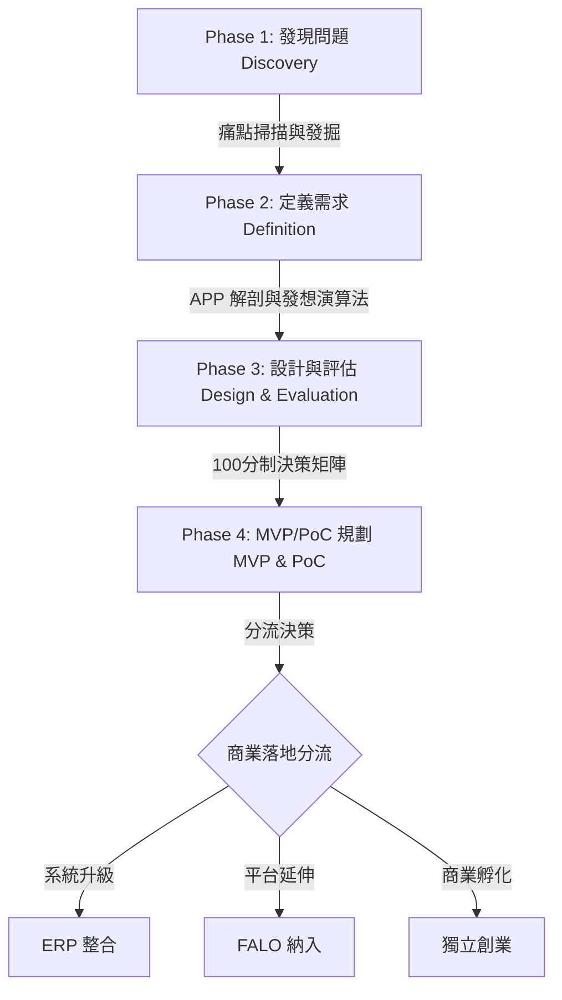

# AI APP Studio: From Idea to AI Product
### 從創意到 AI 產品的完整實作藍圖與工作坊套件

歡迎使用 **AI APP Studio** 實作藍圖。這是一套專門為產品經理、創業家、組織創新推動者以及 AI Native 工作流設計師打造的系統化落地指南。

本專案的核心宗旨是：**「不是學習 AI 工具，而是訓練如何找到值得被 AI 解決的問題，並將其轉化為高價值的 AI 原生產品。」**

---

## 核心設計哲學

在 AI 時代，最珍貴的資源不是演算法或算力，而是**「對問題的深刻洞察」**。如果我們的思維被既有的 ERP 或產品框架綁死，我們就只能做出「微調型」的改良。

**AI APP Studio** 主張打破框架，從工作、生活、管理、教育、銷售、財務、生產與個人效率等維度進行全方位的需求發掘。先發想出最具價值的解決方案，再回頭進行商業決策：
* 哪些適合整合進既有的 **ERP**？
* 哪些適合納入 **FALO** 平台？
* 哪些甚至具備**獨立創業**、成為全新 SaaS 的潛力？

---

## 實作藍圖四大階段 (The 4-Phase Roadmap)

本藍圖將 AI 產品的誕生劃分為四個核心階段，每個階段皆有對應的實作工具與指南：

### 1. 發現問題 (Discovery)
從日常與工作中的「重複、繁瑣、易出錯、抗拒」中掃描真實痛點，避免做出無人問津的「偽需求」產品。
* **對應檔案**：[discovery_validation_playbook.md](file:///Users/force/Google_Antigravity/ai_app/discovery_validation_playbook.md) 的第一部分。

### 2. 定義需求 (Definition)
透過「APP 解剖術」與「AI APP 發想演算法」，將模糊的痛點轉化為結構化的產品邏輯：`問題 → 流程 → 資料 → AI → APP`。
* **對應檔案**：[methodology_blueprint.md](file:///Users/force/Google_Antigravity/ai_app/methodology_blueprint.md)。

### 3. 設計與評估 (Design & Evaluation)
使用 100 分制的評審大會機制，從「痛點強度、市場需求、AI 適合度、技術可行性、商業價值」五大維度對構想進行科學評估與優先級排序。
* **對應檔案**：[scorecard.md](file:///Users/force/Google_Antigravity/ai_app/scorecard.md) 與 [backlog_template.md](file:///Users/force/Google_Antigravity/ai_app/backlog_template.md)。

### 4. MVP 與 PoC 規劃 (MVP & PoC)
定義產品的首發版本規格，並規劃如何以無程式碼/低程式碼工具（如 Dify, Make, ChatGPT 等）在數天內搭建出可運作的 MVP，進行技術可行性驗證（PoC）。
* **對應檔案**：[mvp_poc_guide.md](file:///Users/force/Google_Antigravity/ai_app/mvp_poc_guide.md)。

---

## 檔案架構與導覽 (File Structure)

本工作空間包含以下核心檔案，您可以根據需要點擊跳轉閱讀：

| 檔案名稱 | 類型 | 核心內容與用途 |
| :--- | :--- | :--- |
| **[README.md](file:///Users/force/Google_Antigravity/ai_app/README.md)** | 總覽 | 藍圖整體願景、核心哲學與導覽地圖（本檔案）。 |
| **[methodology_blueprint.md](file:///Users/force/Google_Antigravity/ai_app/methodology_blueprint.md)** | 方法論 | 白話解析 AI APP/Workflow/Agent 差異、解剖主流 App、20 個 AI-Native 案例分析。 |
| **[discovery_validation_playbook.md](file:///Users/force/Google_Antigravity/ai_app/discovery_validation_playbook.md)** | 手冊 | 痛點掃描框架、需求驗證機制、ERP/FALO/獨立創業分流決策模型。 |
| **[mvp_poc_guide.md](file:///Users/force/Google_Antigravity/ai_app/mvp_poc_guide.md)** | 指南 | 無程式碼/低程式碼 MVP 規劃法、規格定義書範本、PoC 驗證路徑圖。 |
| **[backlog_template.md](file:///Users/force/Google_Antigravity/ai_app/backlog_template.md)** | 模板/數據 | **50+ 個優先排序與分流的 AI APP 創意 Backlog**（ID, 名稱, 問題, 對象, 價值）。 |
| **[scorecard.md](file:///Users/force/Google_Antigravity/ai_app/scorecard.md)** | 工具 | 100 分制評審指標細則、評估表與決策優先級矩陣。 |
| **[idea_library.md](file:///Users/force/Google_Antigravity/ai_app/idea_library.md)** | 數據庫 | **100 個 AI APP 創意庫**（橫跨 15 大領域，含名稱、痛點、對象、MVP 想法）。 |
| **[workshop_facilitator_guide.md](file:///Users/force/Google_Antigravity/ai_app/workshop_facilitator_guide.md)** | 講師指南 | 1 天密集工作坊的時程規劃、高互動分組活動指南與講師口語化逐字講稿。 |
| **[student_worksheets.md](file:///Users/force/Google_Antigravity/ai_app/student_worksheets.md)** | 學員工具 | 學員實作工作紙與練習模板，供工作坊現場或個人實作使用。 |

---

## 如何開始使用這套藍圖？

1. **如果您是講師或引導者**：請直接閱讀 **[workshop_facilitator_guide.md](file:///Users/force/Google_Antigravity/ai_app/workshop_facilitator_guide.md)**，裡面有完整的課程大綱、分組活動與逐字稿，並搭配 **[student_worksheets.md](file:///Users/force/Google_Antigravity/ai_app/student_worksheets.md)** 進行授課。
2. **如果您是產品經理或創業家**：您可以將 **[methodology_blueprint.md](file:///Users/force/Google_Antigravity/ai_app/methodology_blueprint.md)** 作為思維工具，並利用 **[discovery_validation_playbook.md](file:///Users/force/Google_Antigravity/ai_app/discovery_validation_playbook.md)** 來梳理自己的想法，最後在 **[backlog_template.md](file:///Users/force/Google_Antigravity/ai_app/backlog_template.md)** 管理您的產品線。
3. **如果您需要尋求靈感**：請直接翻閱 **[idea_library.md](file:///Users/force/Google_Antigravity/ai_app/idea_library.md)**，這裡有 100 個開箱即用的 AI 應用創意，能為您在各個行業的應用提供切實的參考。
